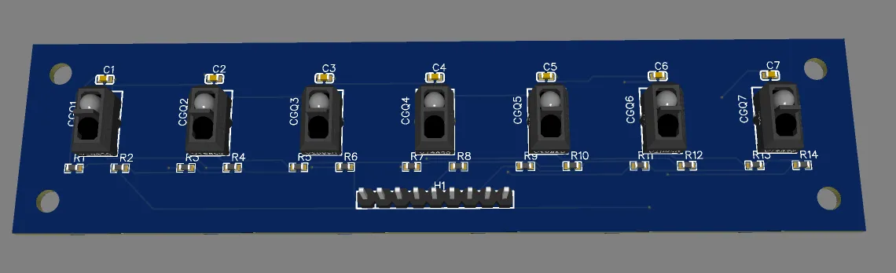
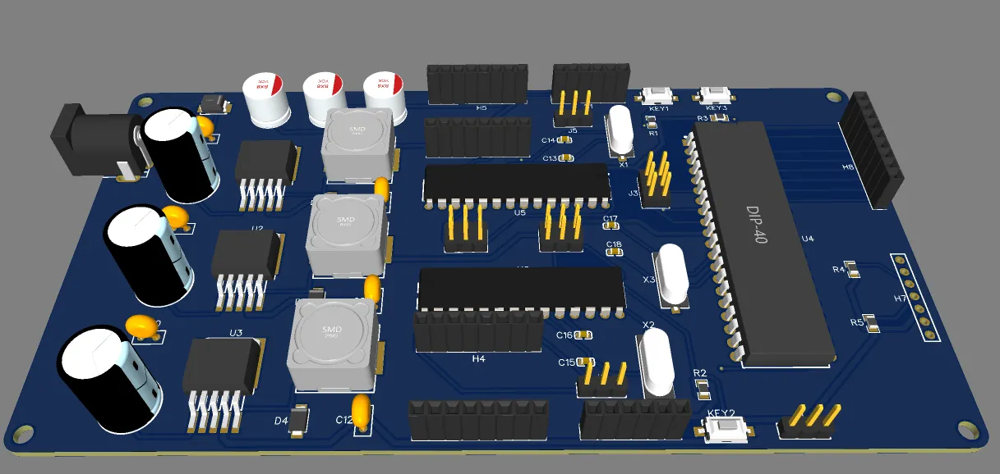

# Line following mobile robot with color sensor
This repository contains all files and documents for the Line following mobile robot. The robot was constructed for the Mechatronics Design Project Course at Ho Chi Minh City University of Technology (HCMUT). Our team member includes:
- Huynh Ba Loc
- Phan Dang Khoi Nguyen
- Truong An Quoc
- Nguyen Hoang Minh

The sequence of operation is as follow:
1. Starts following the line until the loading zone, which is marked by a horizontal line.
2. Stops and waits for the package.
3. After the package is loaded, determines its color and chooses a corresponding path.
4. Follows the chosen path.
5. Stops at the end of the line.

The robot can be seen working in [this video](https://youtu.be/HqmgRXV4fzo?si=YYQn4gw1GglHw1m8).

## Building the robot
The robot is built by following [this assembly drawing](ME4071_Mechanical_Assembly_drawing_HuynhBaLoc_NguyenHoangMinh_PhanDangKhoiNguyen_TruongAnQuoc.pdf).

<!--  -->

## PCB
All required PCBs are located in [this PCB folder](pcb).

 

## Motor PID
To be updated.

## Sensor calibration
After constructing the robot, the line detecting sensor module needs to be calibrated. This MAX-MIN values of each sensor are obtained and set in [the main code](code/A32-MasterMCU.ino).

## Uploading the code
The codes are uploaded using [this AVR USBasp](https://hshop.vn/products/mach-nap-avr-usbasp-2) from Arduino IDE. 

## Notes
To be updated.
